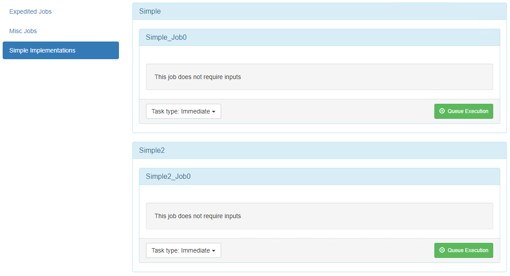

# Hangfire.Dashboard.Management.v2


Hangfire.Dashboard.Management.v2 provides a Management page in the default dashboard of [Hangfire](https://www.hangfire.io) that allows for manually kicking 
off jobs or maintaining the queuing and scheduling of jobs.


## Features

 - **Automatic page and menu generation**: Simple attributes on your job classes to define management pages. 
 - **Automatic input generation**: Simple attributes on your properties allows for auto generation of input fields. (bool, int, text, DateTime, and Enum)
 - **Support for IJobCancellationToken and PerformContext**: These job properties are automatically ignored and set null on job creation.
 - **Simple Fire-and-Forget**: Directly from your Management dashboard you can fire any Job.
 - **Set a Cron Job**: Define your cron with a UI and set it for any Job.
 - **Delay execution**: Schedule your job to run in the future. (Currently 5, 10, 15, 30 and 60 min intervals or a custom TimeSpan)
 - **Extensible**: Use the framework to add your own additional pages.

## Why another Hangfire Dashboard Manager?

I have looked into the other Hangfire Dashboard Managers and found that they each lack a little something and it did not seem to me that they 
where being maintained any longer.

This is why I wanted to start a new project, but instead of re-creating the wheel, I took [pjrharley's](https://github.com/pjrharley) existing 
[Hangfire.Core.Management.Dashboard](https://github.com/pjrharley/Hangfire.Core.Dashboard.Management) and forked it into a new repository.

I then scoured through [mccj's](https://github.com/mccj) code for [Hangfire.Dashboard.Management](https://github.com/mccj/Hangfire.Dashboard.Management)
and incorporated some of their ideas into this version as well.


## Setup for ASP.Net

```c#
using Hangfire;
using Hangfire.Dashboard.Management.v2;
using Hangfire.Dashboard.Management.v2.Support;
...
namespace Application
{
	public class Startup
	{
		private IEnumerable<IDisposable> GetHangfireServers()
		{
			GlobalConfiguration.Configuration
				/* Specify your storage */
				/* Here we are using Hangfire.MemoryStorage */
				.UseMemoryStorage()
					
				/* Add the Management page specifying the assembly or assemblies that contain your IJob classes */
				/* Here we are using the website's assembly */
				.UseManagementPages(typeof(Startup).Assembly);

			/* Return your Hangfire Server */
			var options = new BackgroundJobServerOptions();
			var queues = new List<string>();
			queues.Add("default");
			
			/*
				See note about JobsHelper.GetAllQueues()
				under the 'Defining Jobs' section below
			*/
			queues.AddRange(JobsHelper.GetAllQueues());

			options.Queues = queues.Distinct().ToArray();
			yield return new BackgroundJobServer(options);
		}

		public void Configuration(IAppBuilder app)
		{
			/* Configure Hangfire ASP.Net */
			app.UseHangfireAspNet(GetHangfireServers);
			
			/* Configure that Hangfire Dashboard */
			app.UseHangfireDashboard("/hangfire", new DashboardOptions()
			{
				DisplayStorageConnectionString = false,
				DashboardTitle = "ASP.Net Hangfire Management",
				StatsPollingInterval = 5000
			});
		}
	}
}
```

## Setup for ASP.Net Core

```c#
using Hangfire;
using Hangfire.Dashboard.Management.v2;
using Hangfire.Dashboard.Management.v2.Support;
...
namespace Application
{
	public class Startup
	{
		public Startup(IConfiguration configuration)
		{
			Configuration = configuration;
		}

		public IConfiguration Configuration { get; }

		public void ConfigureServices(IServiceCollection services)
		{
			services.AddHangfire((configuration) =>
			{
				configuration
					/* Specify your storage */
					/* Here we are using Hangfire.MemoryStorage */
					.UseMemoryStorage()
					
					/* Add the Management page specifying the assembly or assemblies that contain your IJob classes */
					/* Here we are using the website's assembly */
					.UseManagementPages(typeof(Startup).Assembly);
			});

			/* Add your Hangfire Server */
			services.AddHangfireServer((options) =>
			{
				var queues = new List<string>();
				queues.Add("default");
				/*
					See note about JobsHelper.GetAllQueues()
					under the 'Defining Jobs' section below
				*/
				queues.AddRange(JobsHelper.GetAllQueues());

				options.Queues = queues.Distinct().ToArray();
			});

			/* Other code */
			//...
		}

		public void Configure(IApplicationBuilder app, IWebHostEnvironment env)
		{
			/* Other code */
			//...

			/* Configure that Hangfire Dashboard */
			app.UseHangfireDashboard("/hangfire", new DashboardOptions()
			{
				DisplayStorageConnectionString = false,
				DashboardTitle = "ASP.Net Core Hangfire Management",
				StatsPollingInterval = 5000
			});
		}
	}
}
```
## Defining Menu Items

Menu items are created based on your "Job" class's `ManagementPage` attribute.
A "Job" class is defined by any class that implements the `IJob` interface.

In its simplest form, the following is a valid Job class implementation.

```c#
[ManagementPage(MenuName = "Simple Implementation", Title = nameof(Simple))]
public class Simple : IJob
{
	public void Job0(PerformContext context, IJobCancellationToken token)
	{
	}
}
```
Which generates like this...


From this example, you can see that there is a job displayed for the function in the class.
Each function within the class will create a new panel on the UI.
The function may be decorated with the `DisplayName` and/or `Description` attributes.

> **NOTE**: You can maintain different classes under the same `MenuName`.
>This will allow you to have multiple classes with different titles all contained under the same menu.
> ---
>Example...
>```c#
>[ManagementPage(MenuName = "Simple Implementations", Title = nameof(Simple))]
>public class Simple : IJob
>{
>    public void Job0(PerformContext context, IJobCancellationToken token)
>    {
>    }
>}
>
>[ManagementPage(MenuName = "Simple Implementations", Title = nameof(Simple2))]
>public class Simple2 : IJob
>{
>    public void Job0(PerformContext context, IJobCancellationToken token)
>    {
>    }
>}
>```
>Generates the following
>
>

## Defining Jobs
In the following example, we have created a new "Job" class called `Expedited` and added a method to it with the name `Job1`.
We added the mandatory `ManagementPage` attribute and set the `MenuName` (**A**) and `Title` (**B**).
> **NOTE**:
> Unlike some other implementations, the queue for the job is not determined by the `ManagementPage` attribute.
> The queue can be defined on each method independently by using the `Hangfire.Queue` attribute.
> If this attribute is not specified, the job will run in the "DEFAULT" queue.
>
> To help make it easier to find the queues that are used in your code, I have created a static helper method named `JobsHelper.GetAllQueues()`.
 

To customize the `Job1` method's name we add the `DisplayName` attribute (**C**) to the method with the desired name.
We also added a description (**D**) to explain what this job does and some parameters for the job.

```c#
[ManagementPage(MenuName = "Expedited Jobs", Title = nameof(Expedited))]
/*              A                            B                        */
public class Expedited : IJob
{
	[DisplayName("Job Number 1")] //C
	[Description("This is the description for Job Number 1")] //D
	[Queue("NOW")]
	public void Job1(PerformContext context, IJobCancellationToken token,
		[DisplayData(
			Label = "String Input 1",
			Description = "This is the description text for the string input with a default value and the control is disabled",
			DefaultValue = "This is the Default Value",
			IsDisabled = true
		)]
		string strInput1,

		[DisplayData(
			Placeholder = "This is the placeholder text",
			Description = "This is the description text for the string input without a default value and the control is enabled"
		)]
		string strInput2,

		[DisplayData(
			Label = "DateTime Input",
			Placeholder = "What is the date and time?",
			DefaultValue = "1/20/2020 1:02 AM",
			Description = "This is a date time input control"
		)]
		DateTime dtInput,

		[DisplayData(
			Label = "Boolean Input",
			DefaultValue = true,
			Description = "This is a boolean input"
		)]
		bool blInput,

		[DisplayData(
			Label = "Select Input",
			DefaultValue = TestEnum.Test5,
			Description = "Based on an enum object"
		)]
		TestEnum enumTest
	)
	{
		//Do awesome things here
	}

	public enum TestEnum
	{
		Test1,
		Test2,
		Test3,
		Test4 = 44,
		Test5
	}
}
```


Each input property, other than `IJobCancellationToken` and `PerformContext`, may be decorated with the `DisplayData` attribute.
This defines the input's label, placeholder text, and description for better readability. 


See the [DisplayDataAttribute.cs](/src/Metadata/DisplayDataAttribute.cs) for more information on these attributes.


## Runnable Examples
I have included two web applications, ASP.Net and ASP.Net Core, that give you an example of how to configure and create Menu Items as well as Jobs.  These can be found in the [examples](/examples) folder.

## Caution
As with the other projects this one is based on, I have not done extensive testing.

Things might not work as expected and could just not work. There has only been manual testing so far. If attributes are missing I'm not
sure what will happen.

## License

Copyright (c) 2020

Permission is hereby granted, free of charge, to any person obtaining a copy
of this software and associated documentation files (the "Software"), to deal
in the Software without restriction, including without limitation the rights
to use, copy, modify, merge, publish, distribute, sub-license, and/or sell
copies of the Software, and to permit persons to whom the Software is
furnished to do so, subject to the following conditions:

The above copyright notice and this permission notice shall be included in all
copies or substantial portions of the Software.

THE SOFTWARE IS PROVIDED "AS IS", WITHOUT WARRANTY OF ANY KIND, EXPRESS OR
IMPLIED, INCLUDING BUT NOT LIMITED TO THE WARRANTIES OF MERCHANTABILITY,
FITNESS FOR A PARTICULAR PURPOSE AND NONINFRINGEMENT. IN NO EVENT SHALL THE
AUTHORS OR COPYRIGHT HOLDERS BE LIABLE FOR ANY CLAIM, DAMAGES OR OTHER
LIABILITY, WHETHER IN AN ACTION OF CONTRACT, TORT OR OTHERWISE, ARISING FROM,
OUT OF OR IN CONNECTION WITH THE SOFTWARE OR THE USE OR OTHER DEALINGS IN THE
SOFTWARE.
