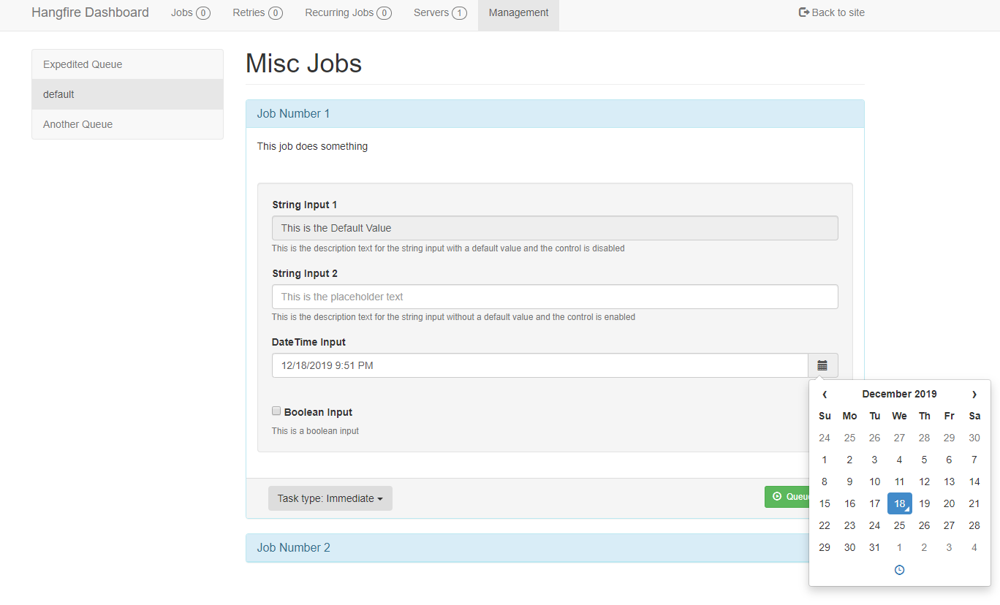

# Hangfire.Dashboard.Management.v2Unofficial


Hangfire.Dashboard.Management.v2Unofficial provides a Management page in the default dashboard that allows for manually kicking 
off jobs or maintaining the queuing and scheduling of jobs.



## Features

 - **Automatic page and menu generation**: Simple attributes on your job classes define management pages. 
 - **Automatic input generation**: Simple attributes on your properties allows for auto generation of input fields. (bool, int, text, DateTime)
 - **Support for IJobCancellationToken and PerformContext**: These job properties are automatically ignored and set null on job creation.
 - **Simple Fire-and-Forget**: Directly from your Management dashboard you can fire any Job.
 - **Set a Cron Job**: Define your cron and set it for any Job.
 - **Delay execution**: Schedule your job to run in the future. (Currently 5, 10, 15, 30 and 60 min intervals or a custom TimeSpan)
 - **Extensible**: Use the framework to add your own additional pages.

## Why another Hangfire Dashboard Manager?

I have looked into the other Hangfire Dashboard Managers and found that they each lack a little something and it did not seem to me that they 
where being maintained any longer.

This is why I wanted to start a new project, but instead of re-creating the wheel, I took [pjrharley's](https://github.com/pjrharley) existing 
[Hangfire.Core.Management.Dashboard](https://github.com/pjrharley/Hangfire.Core.Dashboard.Management) and forked it into a new repository.

I then scoured through [mccj's](https://github.com/mccj) code for [Hangfire.Dashboard.Management](https://github.com/mccj/Hangfire.Dashboard.Management)
and incorporated some of their ideas into this version as well.


## Setup

```c#
GlobalConfiguration.Configuration
    .UseManagementPages(<assembly with IJob implementations>);    
```
## Defining Pages

Pages are defined and based on your Job classes. A Job class is defined by any class that implements the IJob interface. The 
class should also have the attribute ManagementPage defined.

Each function within the class is defined as a specific job. The function should be decorated with DisplayName and Description. 
DisplayName will be in the header of the panel and description is part of the panel body.

Each input property, other than IJobCancellationToken and PerformContext, should be decorated with the DisplayData attribute. This
defines the input label and placeholder text for better readability. 

```c#
//[ManagementPage(<Page Title>, <Menu Title>, <Job Queue>)]
[ManagementPage("Misc Jobs", "Miscellaneous", "misc")]
public class MiscJobs : IJob
{
    [DisplayName("Test")]    
    [Description("Test that jobs are running with simple console output.")]
    [AutomaticRetry(Attempts = 0)]
    [DisableConcurrentExecution(90)]
    public void Test(PerformContext context, IJobCancellationToken token,
        [DisplayData("Output Text", "Enter text to output.")] string outputText,
        [DisplayData("Repeat When Completed", "Repeat")] bool repeat,
        [DisplayData("Test Date", "Enter date")] DateTime testDate) 
    {
        context.WriteLine(outputText);
        Thread.Sleep(15000);

        token.ThrowIfCancellationRequested();

        if (repeat)
        {
            context.WriteLine("Queuing the job again from the job.");
            BackgroundJob.Enqueue<MiscJobs>(m => m.Test(context, token, outputText, repeat));
        }
    }
}
```

## Caution
As with the other projects this one is based on, I have not done extensive testing.

Things might not work as expected and could just not work. There has only been manual testing so far. If attributes are missing I'm not
sure what will happen.


## Personal Note
This is my first project that I am releasing into the wild, so please go easy on me.

Please make any pull request for bugs that you may find. I will do my best to keeping
this project up to date with any changes that it may need.

## License

Copyright (c) 2019

Permission is hereby granted, free of charge, to any person obtaining a copy
of this software and associated documentation files (the "Software"), to deal
in the Software without restriction, including without limitation the rights
to use, copy, modify, merge, publish, distribute, sub-license, and/or sell
copies of the Software, and to permit persons to whom the Software is
furnished to do so, subject to the following conditions:

The above copyright notice and this permission notice shall be included in all
copies or substantial portions of the Software.

THE SOFTWARE IS PROVIDED "AS IS", WITHOUT WARRANTY OF ANY KIND, EXPRESS OR
IMPLIED, INCLUDING BUT NOT LIMITED TO THE WARRANTIES OF MERCHANTABILITY,
FITNESS FOR A PARTICULAR PURPOSE AND NONINFRINGEMENT. IN NO EVENT SHALL THE
AUTHORS OR COPYRIGHT HOLDERS BE LIABLE FOR ANY CLAIM, DAMAGES OR OTHER
LIABILITY, WHETHER IN AN ACTION OF CONTRACT, TORT OR OTHERWISE, ARISING FROM,
OUT OF OR IN CONNECTION WITH THE SOFTWARE OR THE USE OR OTHER DEALINGS IN THE
SOFTWARE.
